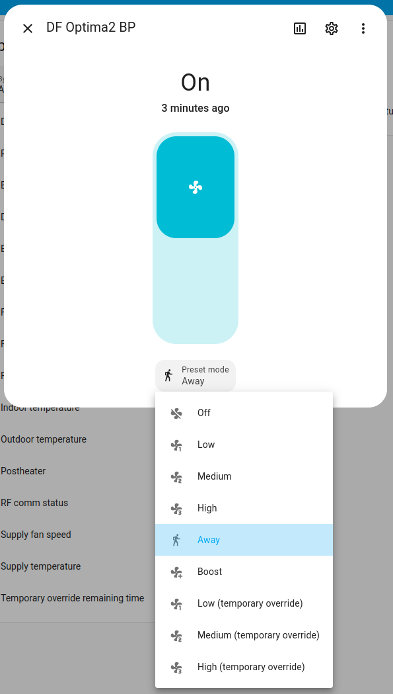
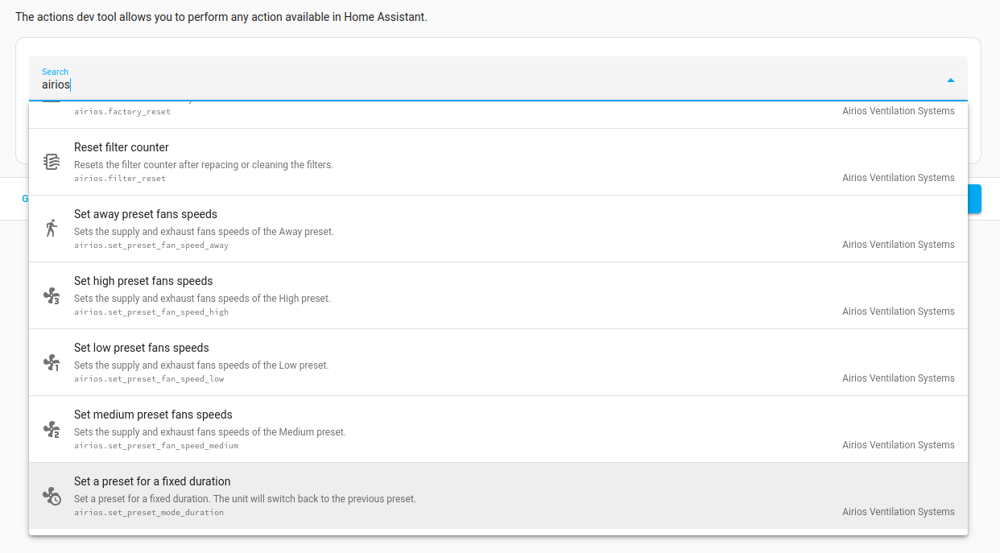

# Airios Home Assistant Component

Home Assistant component that allows you to control and monitor ventilation units and accessories from different manufacturers.

Airios develops and produces components for residential ventilation systems that final manufacturers use to build their products upon, from controller boards to remote controls or sensors. These components communicate over a proprietary RF protocol from Honeywell called Ramses II in the 868Mhz band.

> [!WARNING]
> This integration is not affiliated in any way with Airios nor any final manufacturer, the developers take no responsibility for anything that happens to your devices because of this library.

## Prerequisites

An RF bridge is needed for Home Assistant to access the RF network. There are two bridge models with different interfaces. The Airios BRDG-02R13 has a RS485 serial interface (Modbus-RTU) and the BRDG-02EM23 is an Ethernet device (Modbus-TCP). The final manufacturers use to rebrand and rename these devices.

- Before you can use this integration, make sure you have the RS485 serial bridge. The Ethernet device is not supported.

Please check the [bridge documentation page](doc/1-brdg02r13.md) for more information.

## Tested devices

### RF bridges

* Siber *DFEVORFRS485* (Airios *BRDG-02R13*)

### Ventilation units

* Siber *DF Optima2 BP* (Airios *VMD-02RPS78*)

### Accessories

* Siber *DFEVOPULS4B* (Airios *VMN-02LM11*)

## Features

* Bind controller units and accessories
* Set fan preset modes
* Bypass valve control
* Filter dirty timer reset

## Installation

### HACS

1. Add the repository as a [custom repository](https://hacs.xyz/docs/faq/custom_repositories) in HACS. Type `scabrero/homeassistant-airios-component` in `Repository`, choose `integration` type.
2. Search the Airios integration in HACS, click Download
3. Restart Home Assistant
4. [Add Airios integration](https://my.home-assistant.io/redirect/config_flow_start/?domain=airios_ventilation), or go to Settings > Integrations and add Airios

### Manual

1. Download [the latest release](https://github.com/scabrero/homeassistant-airios-component/releases)
2. Extract the `custom_components` folder to your Home Assistant's config folder, the resulting folder structure should be `config/custom_components/airios_ventilation`
3. Restart Home Assistant
4. [Add Airios integration](https://my.home-assistant.io/redirect/config_flow_start/?domain=airios_ventilation), or go to Settings > Integrations and add Airios

## Options

### Seconds between scans

Data polling interval. **Don't set this below 30 seconds**.

All data from ventilation units and accessories bound to the bridge is fetched together.

## Entities

You can expect these entities (fan name can vary, here "DF Optima2"):

### RF Bridge

| Entity                                                                        | Unit   | Class        |
|-------------------------------------------------------------------------------|--------|--------------|
| Fault status                                                                  |        | problem      |
| RF comm status                                                                |        | connectivity |
| RF load                                                                       | %      |              |
| RF load last hour                                                             | %      |              |
| RF messages                                                                   |        |              |
| RF messages last hour                                                         |        |              |
| Uptime                                                                        | sec    | duration     |

### Ventilation units

| Entity                                                                        | Unit   | Class        |
|-------------------------------------------------------------------------------|--------|--------------|
| Fault status                                                                  |        | problem      |
| RF comm status                                                                |        | connectivity |
| Bypass mode                                                                   |        |              |
| Bypass position                                                               | %      |              |
| Defrost                                                                       |        | running      |
| DF Optima2                                                                    |        |              |
| Error code                                                                    |        | enum         |
| Exhaust fan speed                                                             | %      |              |
| Exhaust fan rpm                                                               | rpm    |              |
| Exhaust temperature                                                           | ºC     | temperature  |
| Filter                                                                        |        | problem      |
| Filter duration                                                               | days   |              |
| Filter remaining                                                              | %      |              |
| Free ventilation cooling offset                                               |        |              |
| Free ventilation setpoint                                                     | ºC     | temperature  |
| Indoor temperature                                                            | ºC     | temperature  |
| Outdoor temperature                                                           | ºC     | temperature  |
| Postheater                                                                    | %      |              |
| Reset filter counter                                                          |        | restart      |
| Supply fan speed                                                              | %      |              |
| Supply fan rpm                                                                | rpm    |              |
| Supply temperature                                                            | ºC     | temperature  |
| Temporary override remaining time                                             | min    |              |

## Services

| Name                        | Description                       | Fields                              |
|-----------------------------|-----------------------------------|-------------------------------------|
| Factory reset               | Reset device to factory defaults  |                                     |
| Device reset                | Reset the device                  |                                     |
| Filter reset                | Reset the filter dirty timer      |                                     |
| Set Preset Fan Speed Away   | Set fans speeds for Away preset   | supply fan speed, exhaust fan speed |
| Set Preset Fan Speed Low    | Set fans speeds for Low preset    | supply fan speed, exhaust fan speed |
| Set Preset Fan Speed Medium | Set fans speeds for Medium preset | supply fan speed, exhaust fan speed |
| Set Preset Fan Speed High   | Set fans speeds for High preset   | supply fan speed, exhaust fan speed |
| Set Preset Mode Duration    | Set a temporary preset override   | preset, duration                    |

Additionally, there are home assistant's built in services for fans.

Search for "airios" in Developer Tools > Services in your Home Assistant instance to get the full list plus an interactive UI.

### Debugging

When debugging or reporting Issues, turn on debug logging using the three dots menu in the Airios integration pane.

When you next deactivate debug logging (in a browser), a debug log file will appear in Downloads.
Attach it as is to your issue (drop it on the edit pane).
