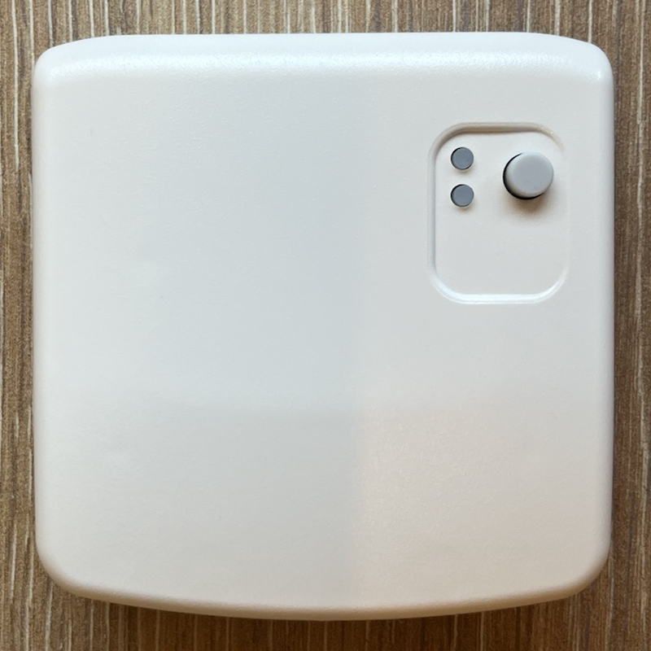
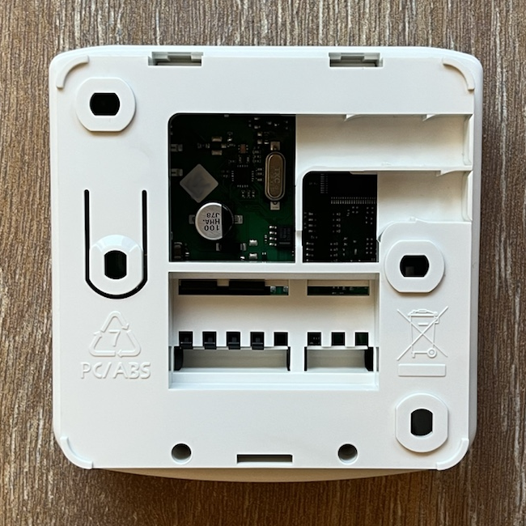
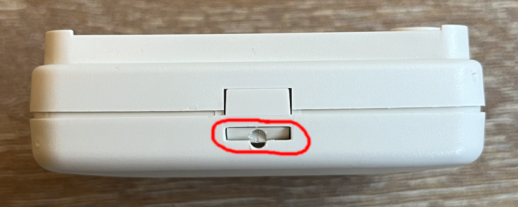
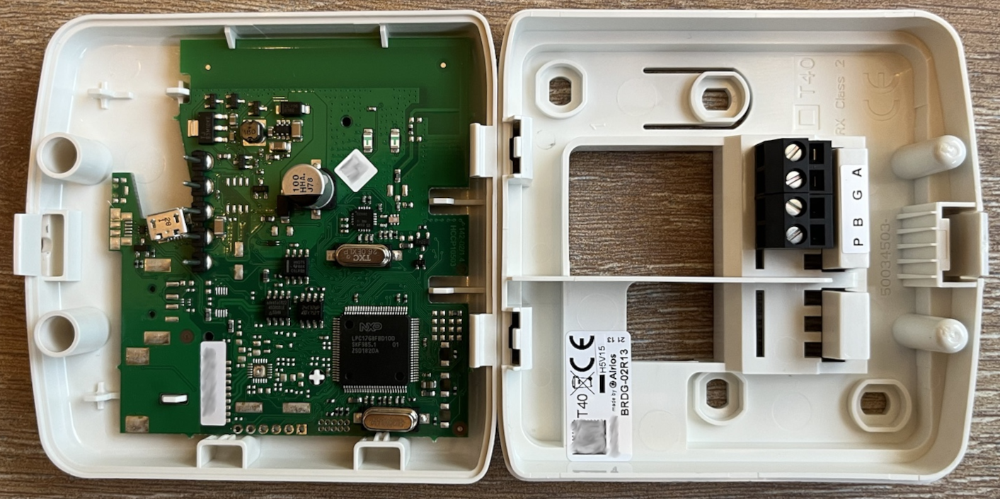

# Airios BRDG-02R13 RF bridge

Ventilation machines controllers and accessories communicate to each other using a proprietary protocol from Honeywell called RAMSES-II. Each device connected to the RAMSES-II network is called a `node` and has its own RF address in the form 0xAABBCC, usually used as the device serial number. The bridge is part of the network so it has its own RF address too. The other nodes, like ventilation units, remotes or sensors bind to the bridge. The bridge creates a virtual Modbus unit with its own Modbus address for each bound node with its own register set. The default Modbus address for the bridge node is 207.

The device has a button and 2 LEDs. The button is used to factory reset the device if pressed for 10 seconds. The LEDs indicate if the device is on (green LED) and if it has an error (red LED). The red LED is on if there is no ventilation controller bound.

## RS485 interface

To access the RS485 connector you must open the device. Use a screwdriver to push the lid on the side and turn at the same time. It is easy but requires some strength.

The RS485 port is labeled as P-B-G-A in the back plate:

| Label | Function       | Notes              |
|-------|----------------|--------------------|
| P     | Power          | 5 to 24v, AC or DC |
| B     | Signal B RS485 |                    |
| G     | Ground         |                    |
| A     | Signal A RS485 |                    |

The default serial configuration is **19200 8E1**.

## About the micro USB connector

The device also has a micro USB connector mainly used to update the firmware but, with some limitations, it can also be used to interface with the device.

If the USB host reads the device USB descriptors immediately after connecting it, the bridge enters in firmware update mode (green led flashes quickly). If there is no activity in the next 15 minutes, the device automatically exit this mode and offers a virtual serial port equivalent to the RS485 interface.

The main problem using this port is that for some reason the device keeps resetting itself after some hours, booting into firmware update mode and thus blocking the device for 15 minutes.
